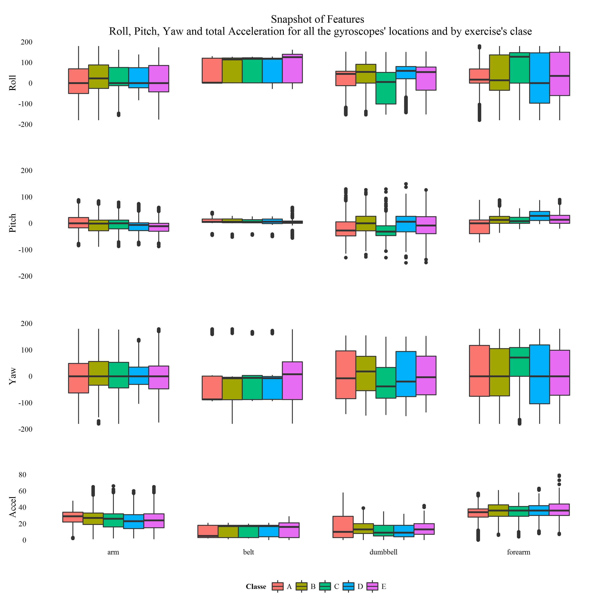
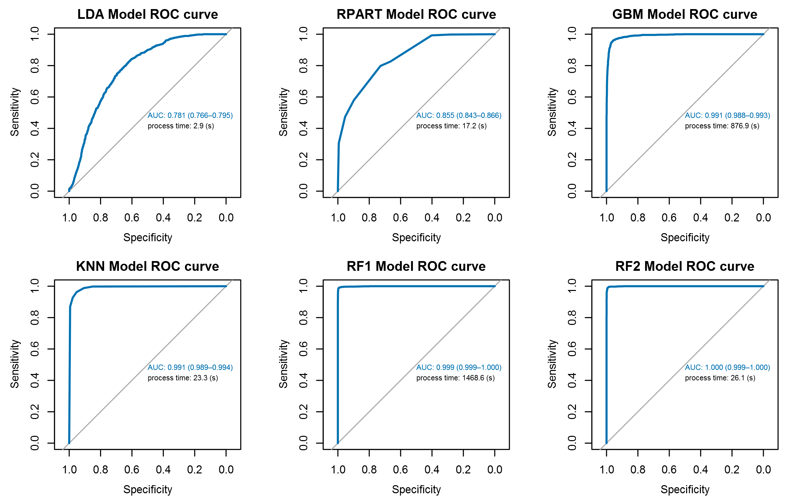

# Machine Learning Writeup
Eduardo B. Díez --- August 2014  
   

## Introduction

This document is born with the vocation to be accessible as a web page from this [gh-page](http://eduardodiez.github.io/ml2/index.html) or a copy in [rpubs](http://rpubs.com/turpial/ml) and the source code ---as a Rmd file--- and the compile result ---as a HTML file--- can be found in this [github](https://github.com/eduardodiez/ml2) repository. The report try to explain how we chose the forecast for 20 cases about the way in which six participants do exercises according with the _datae_ [from this link](http://groupware.les.inf.puc-rio.br/har#weight_lifting_exercises) to finally submit the forecast as the final part of the project.

We'll talk of the predictors that were selected as "features" to develop the model and about the various training methods we used whose results were compared and provided aid to make the final decision based on the accuracy they showed.

## Bunch of Data and very Few Features

In this project we will use data from four accelerometers on the belt, forearm, arm, and dumbbell of six participants. They were asked to perform barbell lifts correctly and incorrectly in 5 different ways. So, the data contain the raw information from the gyroscopes and also some variables derivates from the raw as mean, standard deviation among other few.

After the inspection and work around with the data we arrive to the conclusion that the variables we can understand as real features with added value to be used to model the problem effectively are those about roll, yaw, pitch and total acceleration that correspond with each of the four locations where the accelerometers are registering the movements.

After removal the other variables, we proceeded to the proper ordering of the remaining to present them graphically, so one can easily detect any anomaly that may exist and whereafter was computed the correlation between them. The variable **roll_bell** was found correlated with other two of them thus, we decided to eliminate it from the data set.

Below we show the 15 variables with which we make our model.

<table class='gmisc_table' style='border-collapse: collapse;' >
	<thead>
	<tr><td colspan='2' style='text-align: left;'>
	</td></tr>
	<tr>
		<th style='font-weight: 900; border-bottom: 1px solid grey; border-top: 2px solid grey;'>#</th>
		<th style='border-bottom: 1px solid grey; border-top: 2px solid grey; text-align: center;'>Feature</th>
	</tr>
	</thead><tbody>
	<tr>
		<td style='text-align: center;'>1</td>
		<td style='text-align: center;'>pitch_belt</td>
	</tr>
	<tr>
		<td style='text-align: center;'>2</td>
		<td style='text-align: center;'>yaw_belt</td>
	</tr>
	<tr>
		<td style='text-align: center;'>3</td>
		<td style='text-align: center;'>total_accel_belt</td>
	</tr>
	<tr>
		<td style='text-align: center;'>4</td>
		<td style='text-align: center;'>roll_arm</td>
	</tr>
	<tr>
		<td style='text-align: center;'>5</td>
		<td style='text-align: center;'>pitch_arm</td>
	</tr>
	<tr>
		<td style='text-align: center;'>6</td>
		<td style='text-align: center;'>yaw_arm</td>
	</tr>
	<tr>
		<td style='text-align: center;'>7</td>
		<td style='text-align: center;'>total_accel_arm</td>
	</tr>
	<tr>
		<td style='text-align: center;'>8</td>
		<td style='text-align: center;'>roll_dumbbell</td>
	</tr>
	<tr>
		<td style='text-align: center;'>9</td>
		<td style='text-align: center;'>pitch_dumbbell</td>
	</tr>
	<tr>
		<td style='text-align: center;'>10</td>
		<td style='text-align: center;'>yaw_dumbbell</td>
	</tr>
	<tr>
		<td style='text-align: center;'>11</td>
		<td style='text-align: center;'>total_accel_dumbbell</td>
	</tr>
	<tr>
		<td style='text-align: center;'>12</td>
		<td style='text-align: center;'>roll_forearm</td>
	</tr>
	<tr>
		<td style='text-align: center;'>13</td>
		<td style='text-align: center;'>pitch_forearm</td>
	</tr>
	<tr>
		<td style='text-align: center;'>14</td>
		<td style='text-align: center;'>yaw_forearm</td>
	</tr>
	<tr>
		<td style='border-bottom: 2px solid grey; text-align: center;'>15</td>
		<td style='border-bottom: 2px solid grey; text-align: center;'>total_accel_forearm</td>
	</tr>
	</tbody>
	<tfoot><tr><td colspan='2'>
	Summary of predictors to use.</td></tr></tfoot>
</table>

## Machineries

Before proceeding is important to note the following to the reader:
In the source document `final.Rmd` the chunk corresponding to this point has the option `eval = false` to avoid running this code which is very intensive in CPU load and run time. Additionally, this chunk with name  "Machineries" has several other models that have not been included in the writing of this paper ---plots and tables--- for lack of space, but is operational and again time consuming.

Once the data was prepared, the data set was partitioned  60-40 between training and testing. All methods have similar schemes of cross-validation control with the default values, except for the two random forest, RF1 and RF2, which employ their own bootstrap characteristics in order to evaluate the OOB. Also, one boosting method was include, the GBM. In the source code can be found  lots of additional calculations to check the results, prior to show and resume them.

Follow a panel figure of ROC plots that provide tools to select possibly optimal models and to discard sub-optimal ones independently from the class. In this panel, we can observe the good response of the KNN method ---k-nearest neighbor algorithm--- beside the two random forest ones. Every plot shows, additionally, the process time inverted for each particular algorithm and the whole figure give us an idea of the extensive variety or results.

## Results

We're going to use the results of _confusionMatrix(...)$**byClass**_ to construct tables from each method that we used, in order to analyze the statistical composing each matrix. For convenience in this report we show only two of them. The first corresponds to the result  RF2  by using the the _randomForest()_ function ---with the best fit we got.

<table class='gmisc_table' style='border-collapse: collapse;' >
	<thead>
	<tr><td colspan='6' style='text-align: left;'>
	Table 1. Confussion Matrix Statistics of Dual RF2&dagger; model</td></tr>
	<tr>
		<th style='font-weight: 900; border-bottom: 1px solid grey; border-top: 2px solid grey;'>randomForest()</th>
		<th style='border-bottom: 1px solid grey; border-top: 2px solid grey; text-align: center;'>Class: A</th>
		<th style='border-bottom: 1px solid grey; border-top: 2px solid grey; text-align: center;'>Class: B</th>
		<th style='border-bottom: 1px solid grey; border-top: 2px solid grey; text-align: center;'>Class: C</th>
		<th style='border-bottom: 1px solid grey; border-top: 2px solid grey; text-align: center;'>Class: D</th>
		<th style='border-bottom: 1px solid grey; border-top: 2px solid grey; text-align: center;'>Class: E</th>
	</tr>
	</thead><tbody>
	<tr>
		<td style='text-align: left;'>Sensitivity</td>
		<td style='text-align: center;'>0.99</td>
		<td style='text-align: center;'>0.99</td>
		<td style='text-align: center;'>0.96</td>
		<td style='text-align: center;'>0.98</td>
		<td style='text-align: center;'>1.00</td>
	</tr>
	<tr>
		<td style='text-align: left;'>Specificity</td>
		<td style='text-align: center;'>1.00</td>
		<td style='text-align: center;'>0.99</td>
		<td style='text-align: center;'>1.00</td>
		<td style='text-align: center;'>1.00</td>
		<td style='text-align: center;'>1.00</td>
	</tr>
	<tr>
		<td style='text-align: left;'>Pos Pred Value</td>
		<td style='text-align: center;'>0.99</td>
		<td style='text-align: center;'>0.97</td>
		<td style='text-align: center;'>0.98</td>
		<td style='text-align: center;'>0.99</td>
		<td style='text-align: center;'>0.99</td>
	</tr>
	<tr>
		<td style='text-align: left;'>Neg Pred Value</td>
		<td style='text-align: center;'>1.00</td>
		<td style='text-align: center;'>1.00</td>
		<td style='text-align: center;'>0.99</td>
		<td style='text-align: center;'>1.00</td>
		<td style='text-align: center;'>1.00</td>
	</tr>
	<tr>
		<td style='text-align: left;'>Prevalence</td>
		<td style='text-align: center;'>0.28</td>
		<td style='text-align: center;'>0.19</td>
		<td style='text-align: center;'>0.18</td>
		<td style='text-align: center;'>0.16</td>
		<td style='text-align: center;'>0.18</td>
	</tr>
	<tr>
		<td style='text-align: left;'>Detection Rate</td>
		<td style='text-align: center;'>0.28</td>
		<td style='text-align: center;'>0.19</td>
		<td style='text-align: center;'>0.17</td>
		<td style='text-align: center;'>0.16</td>
		<td style='text-align: center;'>0.18</td>
	</tr>
	<tr>
		<td style='text-align: left;'>Detection Prevalence</td>
		<td style='text-align: center;'>0.28</td>
		<td style='text-align: center;'>0.19</td>
		<td style='text-align: center;'>0.17</td>
		<td style='text-align: center;'>0.16</td>
		<td style='text-align: center;'>0.18</td>
	</tr>
	<tr>
		<td style='border-bottom: 2px solid grey; text-align: left;'>Balanced Accuracy</td>
		<td style='border-bottom: 2px solid grey; text-align: center;'>1.00</td>
		<td style='border-bottom: 2px solid grey; text-align: center;'>0.99</td>
		<td style='border-bottom: 2px solid grey; text-align: center;'>0.98</td>
		<td style='border-bottom: 2px solid grey; text-align: center;'>0.99</td>
		<td style='border-bottom: 2px solid grey; text-align: center;'>1.00</td>
	</tr>
	</tbody>
	<tfoot><tr><td colspan='6'>
	&dagger; The predictions of this model achieved a score of 20 / 20 in the submission part of the project, 
same as RF1 and KNN models.</td></tr></tfoot>
</table>

The second one correspond with the boosting GBM method by using the  function _train(..., method = "gbm")_

<table class='gmisc_table' style='border-collapse: collapse;' >
	<thead>
	<tr><td colspan='6' style='text-align: left;'>
	Table 2. Confussion Matrix Statistics of Boosting GBM&dagger; model</td></tr>
	<tr>
		<th style='font-weight: 900; border-bottom: 1px solid grey; border-top: 2px solid grey;'>method='gbm'</th>
		<th style='border-bottom: 1px solid grey; border-top: 2px solid grey; text-align: center;'>Class: A</th>
		<th style='border-bottom: 1px solid grey; border-top: 2px solid grey; text-align: center;'>Class: B</th>
		<th style='border-bottom: 1px solid grey; border-top: 2px solid grey; text-align: center;'>Class: C</th>
		<th style='border-bottom: 1px solid grey; border-top: 2px solid grey; text-align: center;'>Class: D</th>
		<th style='border-bottom: 1px solid grey; border-top: 2px solid grey; text-align: center;'>Class: E</th>
	</tr>
	</thead><tbody>
	<tr>
		<td style='text-align: left;'>Sensitivity</td>
		<td style='text-align: center;'>0.97</td>
		<td style='text-align: center;'>0.88</td>
		<td style='text-align: center;'>0.86</td>
		<td style='text-align: center;'>0.92</td>
		<td style='text-align: center;'>0.95</td>
	</tr>
	<tr>
		<td style='text-align: left;'>Specificity</td>
		<td style='text-align: center;'>0.98</td>
		<td style='text-align: center;'>0.97</td>
		<td style='text-align: center;'>0.98</td>
		<td style='text-align: center;'>0.99</td>
		<td style='text-align: center;'>0.99</td>
	</tr>
	<tr>
		<td style='text-align: left;'>Pos Pred Value</td>
		<td style='text-align: center;'>0.96</td>
		<td style='text-align: center;'>0.86</td>
		<td style='text-align: center;'>0.90</td>
		<td style='text-align: center;'>0.94</td>
		<td style='text-align: center;'>0.93</td>
	</tr>
	<tr>
		<td style='text-align: left;'>Neg Pred Value</td>
		<td style='text-align: center;'>0.99</td>
		<td style='text-align: center;'>0.97</td>
		<td style='text-align: center;'>0.97</td>
		<td style='text-align: center;'>0.98</td>
		<td style='text-align: center;'>0.99</td>
	</tr>
	<tr>
		<td style='text-align: left;'>Prevalence</td>
		<td style='text-align: center;'>0.28</td>
		<td style='text-align: center;'>0.19</td>
		<td style='text-align: center;'>0.18</td>
		<td style='text-align: center;'>0.17</td>
		<td style='text-align: center;'>0.18</td>
	</tr>
	<tr>
		<td style='text-align: left;'>Detection Rate</td>
		<td style='text-align: center;'>0.27</td>
		<td style='text-align: center;'>0.17</td>
		<td style='text-align: center;'>0.16</td>
		<td style='text-align: center;'>0.15</td>
		<td style='text-align: center;'>0.17</td>
	</tr>
	<tr>
		<td style='text-align: left;'>Detection Prevalence</td>
		<td style='text-align: center;'>0.28</td>
		<td style='text-align: center;'>0.19</td>
		<td style='text-align: center;'>0.17</td>
		<td style='text-align: center;'>0.16</td>
		<td style='text-align: center;'>0.18</td>
	</tr>
	<tr>
		<td style='border-bottom: 2px solid grey; text-align: left;'>Balanced Accuracy</td>
		<td style='border-bottom: 2px solid grey; text-align: center;'>0.97</td>
		<td style='border-bottom: 2px solid grey; text-align: center;'>0.93</td>
		<td style='border-bottom: 2px solid grey; text-align: center;'>0.92</td>
		<td style='border-bottom: 2px solid grey; text-align: center;'>0.95</td>
		<td style='border-bottom: 2px solid grey; text-align: center;'>0.97</td>
	</tr>
	</tbody>
	<tfoot><tr><td colspan='6'>
	&dagger; The predictions of this model  achieved a score of 19 / 20 in the submission part of the project.</td></tr></tfoot>
</table>

## Final Submission

Now, we are going to use the results of the confusion matrix by _confusionMatrix(...)$**overall**_ to construct a resume table with the values of _kappa_ and accuracy ---with its correspondent 95% ci--- for each algorithm we've shown in this report in order to have the completed  panorama of our finds. 

<table class='gmisc_table' style='border-collapse: collapse;' >
	<thead>
	<tr><td colspan='8' style='text-align: left;'>
	Table 3. Summary of <i>Kappas</i> & Accuracies</td></tr>
	<tr>
		<th style='border-top: 2px solid grey;'></th>
		<th colspan='2' style='font-weight: 900; border-top: 2px solid grey; text-align: center;'></th><th style='border-top: 2px solid grey;; border-bottom: hidden;'>&nbsp;</th>
		<th colspan='2' style='font-weight: 900; border-bottom: 1px solid grey; border-top: 2px solid grey;'>Accuracy CI</th><th style='border-top: 2px solid grey;; border-bottom: hidden;'>&nbsp;</th>
		<th colspan='1' style='font-weight: 900; border-bottom: 1px solid grey; border-top: 2px solid grey;'>Submission</th>
	</tr>
	<tr>
		<th style='font-weight: 900; border-bottom: 1px solid grey; '>method</th>
		<th style='border-bottom: 1px solid grey; text-align: center;'>Kappa</th>
		<th style='border-bottom: 1px solid grey; text-align: center;'>Accuracy</th>
		<th style='border-bottom: 1px solid grey;' colspan='1'>&nbsp;</th>
		<th style='border-bottom: 1px solid grey; text-align: center;'>L: 2.5%</th>
		<th style='border-bottom: 1px solid grey; text-align: center;'>U: 97.5%</th>
		<th style='border-bottom: 1px solid grey;' colspan='1'>&nbsp;</th>
		<th style='border-bottom: 1px solid grey; text-align: center;'>Score</th>
	</tr>
	</thead><tbody>
	<tr>
		<td style='text-align: left;'>LDA</td>
		<td style='text-align: center;'>0.3088</td>
		<td style='text-align: center;'>0.4560</td>
		<td style='' colspan='1'>&nbsp;</td>
		<td style='text-align: center;'>0.4450</td>
		<td style='text-align: center;'>0.4671</td>
		<td style='' colspan='1'>&nbsp;</td>
		<td style='text-align: center;'>11/20</td>
	</tr>
	<tr>
		<td style='text-align: left;'>RPART</td>
		<td style='text-align: center;'>0.3992</td>
		<td style='text-align: center;'>0.5213</td>
		<td style='' colspan='1'>&nbsp;</td>
		<td style='text-align: center;'>0.5102</td>
		<td style='text-align: center;'>0.5324</td>
		<td style='' colspan='1'>&nbsp;</td>
		<td style='text-align: center;'>4/20&dagger;</td>
	</tr>
	<tr>
		<td style='text-align: left;'>KNN</td>
		<td style='text-align: center;'>0.8977</td>
		<td style='text-align: center;'>0.9191</td>
		<td style='' colspan='1'>&nbsp;</td>
		<td style='text-align: center;'>0.9128</td>
		<td style='text-align: center;'>0.9250</td>
		<td style='' colspan='1'>&nbsp;</td>
		<td style='text-align: center;'>20/20&Dagger;</td>
	</tr>
	<tr>
		<td style='text-align: left;'>GBM</td>
		<td style='text-align: center;'>0.9012</td>
		<td style='text-align: center;'>0.9219</td>
		<td style='' colspan='1'>&nbsp;</td>
		<td style='text-align: center;'>0.9157</td>
		<td style='text-align: center;'>0.9277</td>
		<td style='' colspan='1'>&nbsp;</td>
		<td style='text-align: center;'>19/20&dagger;</td>
	</tr>
	<tr>
		<td style='text-align: left;'>RF1</td>
		<td style='text-align: center;'>0.9776</td>
		<td style='text-align: center;'>0.9823</td>
		<td style='' colspan='1'>&nbsp;</td>
		<td style='text-align: center;'>0.9791</td>
		<td style='text-align: center;'>0.9851</td>
		<td style='' colspan='1'>&nbsp;</td>
		<td style='text-align: center;'>20/20&Dagger;</td>
	</tr>
	<tr>
		<td style='border-bottom: 2px solid grey; text-align: left;'>RF2</td>
		<td style='border-bottom: 2px solid grey; text-align: center;'>0.9803</td>
		<td style='border-bottom: 2px solid grey; text-align: center;'>0.9845</td>
		<td style='border-bottom: 2px solid grey;' colspan='1'>&nbsp;</td>
		<td style='border-bottom: 2px solid grey; text-align: center;'>0.9815</td>
		<td style='border-bottom: 2px solid grey; text-align: center;'>0.9871</td>
		<td style='border-bottom: 2px solid grey;' colspan='1'>&nbsp;</td>
		<td style='border-bottom: 2px solid grey; text-align: center;'>20/20&Dagger;</td>
	</tr>
	</tbody>
	<tfoot><tr><td colspan='8'>
	&dagger; RPART and GBM methods show that a model which fits the data well does not necessarily forecast well. We should expect RPART doing it better than LDA and GBM than KNN but, it is not the case. 
&Dagger; KNN, RF1 and RF2 agree with the same 20 responses to be submited.</td></tr></tfoot>
</table>

We observe easily, by inspecting Table 3, that the two best accuracy results, both about 98%, agree in the 20 answers ---prior to make the submission---  and there is a third algorithm that also matches these responses. So, with a 98% accuracy and commonality between three different algorithms, all with high accuracy, cause us to be confident that these are the answers ---the predictions of those three methods--- we will submit.

And so we did and got a correct result in all 20 answers.

Additionally, the table has added the submission results virtually achieved for each method, once we submitted the answers and got a score of 20 / 20 in the first try we did.

## About this Document

All analyses were performed using _R version 3.1.1 (2014-07-10)_ and _RStudio_ as IDE, with the default  base packages _parallel, splines, grid, stats, graphics, grDevices, utils, datasets, methods, base_, additionally _BradleyTerry2, brglm, car, class, cluster, codetools, coin, colorspace, digest, evaluate, foreach, formatR, gtable, gtools, htmltools, iterators, kernlab, labeling, latticeExtra, lme4, Matrix, mboost, minqa, modeltools, munsell, mvtnorm, nlme, nloptr, nnet, nnls, party, proto, quadprog, RColorBrewer, Rcpp, rmarkdown, RSNNS, sandwich, scales, sp, stats4, stringr, strucchange, tools, XML, yaml, zoo_ and to produce this report in HTML the packages _Grmd_ and _knitr_. 

